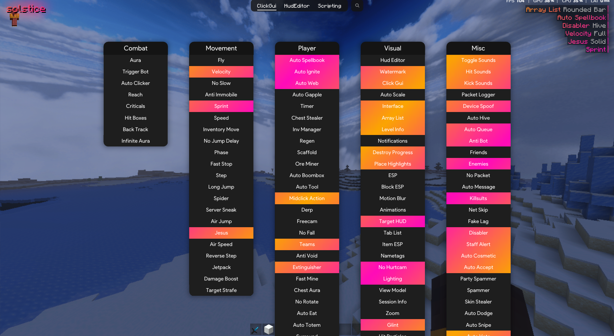

## Information

Since Solstice is no longer being maintained by anyone and I am not playing Minecraft anymore, I decided to release it for you guys!

**Solstice** is a Hive utility mod for **Minecraft: Bedrock Edition**. It was originally created by **VastraKai** in June 2024, then shortly after, the ownership transferred over to **DarkNBTHax**.

## Preview

## Important

- You can use **.irc connect** to connect to the IRC.

- You may need to reinject Solstice the first time due to the client generating data.
  
- This is a **fork** of Solstice and is not based on the official repository.

- The client **will not** be getting updated to newer versions. Please do not ask me to do so.

- If the project continues being maintained from this point onwards, I am **not** responsible for it or any events that may occur.

- The source code for Solstice **will not** be provided by me.

## Requirements 
- The current version of Solstice is **26.13**
- You will need an injector to run this mod, I recommend using [Fate Injector](https://github.com/fligger/FateInjector).

